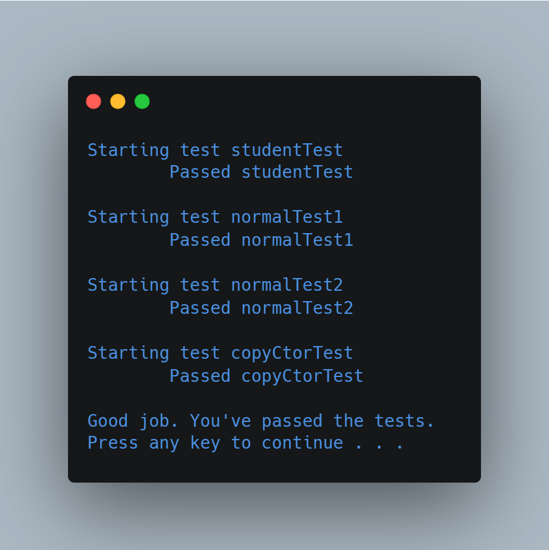

# Dynamic Queue Data Structure

(FSC-BCS-370-Mod5)

## Output

## Assignment Context

This project was assigned as an exercise to fundamentally understand how a Dynamic Queue functions.

The repository contains files provided by the professor, including incomplete code for the queue methods, and test code to check for the proper functionality of said methods.

The goal of the assignment was to complete the code, create a template version, and pass the tests to prove comprehension of the data structure.

## Features

This is a C++ implementation of a circular queue data structure. 

The queues header file is split into two parts, one for a non-templated implementation of the queue, and one for a templated implementation. 
The non-templated implementation is in the `farmingdale` namespace and contains a string array of fixed size for storing elements. 
The templated implementation is also in the `farmingdale` namespace and contains a dynamic array of the type specified in the template parameter.
The header file also includes a definition for the statusCode enum, which is used to indicate the success or failure of various queue operation tests, and some constants used by the implementation.

### Methods 
1. **enqueue** add an element to the back of the queue 
2. **dequeue** remove an element from the front of the queue 
3. **peek** get the element at the front of the queue without removing it 
4. **isEmpty** check if the queue is empty 
5. **isFull** check if the queue is full 
6. **currentQueueCapacity** to get the current capacity of the queue.

Others also include constructor, copy constructor, destructor, == operator.

## Tests

The test code contains three test functions: normalTest1(), normalTest2(), and copyCtorTest(). All of them test different aspects of the queue implementation.

### normalTest1():

This function tests the implementation of a queue with a large number of elements (100000 elements in this case).
It creates an instance of the queue, enqueues 100000 elements, and dequeues all the elements.
It also creates an instance of the queue with integer type and performs similar enqueue and dequeue operations.
It checks whether the dequeue operation retrieves elements in the correct order or not.
Finally, it checks whether the implementation causes any memory leak.

### normalTest2():

This function tests the implementation of the queue with various scenarios of enqueue and dequeue operations.
It first fills the queue with 16 elements (assuming the initial capacity of the queue is 16).
Then, it dequeues 5 elements and enqueues 4 more elements.
After that, it enqueues 100000 more elements, causing a reallocation of the queue.
Finally, it dequeues all the elements and checks whether the dequeue operation retrieves elements in the correct order or not.

### copyCtorTest():

This function tests the implementation of the copy constructor.
It creates an instance of the queue, enqueues 100000 elements, and creates two new instances of the queue using the copy constructor.
It checks whether the two new instances are equal to the original instance or not.
Then, it dequeues all the elements from both the new instances and checks whether they retrieve elements in the correct order or not.
In the templated version of the tests, the same tests are performed on a templated version of the queue implementation, one with string type and the other with integer type.
